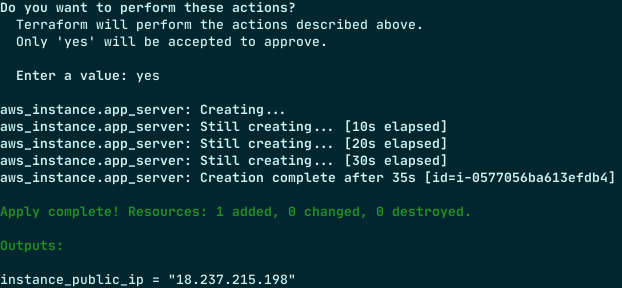

# Week 0
## Useful Links
[AWS Properties EC2](https://docs.aws.amazon.com/AWSCloudFormation/latest/UserGuide/aws-properties-ec2-instance.html)
## Homework
Create Cloudformation script that will create Single EC2 Instance.
### Requirements
Use `Parameters` section for customization of inputs.
Use `Outputs` section to show public IP of the instance
### Solution
[Cloudformation Script](./cloudformation/week-0.yaml)
Create Stack
```shell
aws cloudformation create-stack --profile lohika --template-body file:///Users/avlasov/git/lohika/aws/cloudformation/week-0.yaml --stack-name week-0 --region us-west-2 --parameters ParameterKey=KeyName,ParameterValue=Week0
```

Delete Stack
``` shell
aws cloudformation delete-stack --stack-name week-0 --profile lohika 
```
#### Screenshots


# Week 1
## Useful Links
[Creating Auto Scaling Groups](https://docs.aws.amazon.com/autoscaling/ec2/userguide/creating-auto-scaling-groups-with-cloudformation.html)

[Auto Scaling](https://docs.aws.amazon.com/AWSCloudFormation/latest/UserGuide/quickref-autoscaling.html)

[Deploying Application](https://docs.aws.amazon.com/AWSCloudFormation/latest/UserGuide/deploying.applications.html)

[User Guide](https://docs.aws.amazon.com/AWSCloudFormation/latest/UserGuide)

[AWS Resources Init](https://docs.aws.amazon.com/AWSCloudFormation/latest/UserGuide/aws-resource-init.html)

[Create Key Pairs](https://docs.aws.amazon.com/AWSEC2/latest/UserGuide/create-key-pairs.html)

[cfn-init](https://docs.aws.amazon.com/AWSCloudFormation/latest/UserGuide/cfn-init.html)
## Homework
Develop and deploy via AWS CLI CloudFormation script which will create next infrastructure
* Auto-scaling group (ASG) with two EC2 instances within it (we need to ensure that min amount of instances in the ASG is 2)
* Allow SSH and HTTP access to EC2 instances 
* Add the ability for EC2 instances to install Java 8 during startup ([Documentation](https://docs.aws.amazon.com/AWSCloudFormation/latest/UserGuide/aws-resource-init.html))
### Requirements
Use `Parameters` section for customization of inputs.
### Solution
[Cloudformation Script](./cloudformation/week-1.yaml)

Create Stack
```shell
aws cloudformation create-stack --profile lohika --template-body file:///Users/avlasov/git/lohika/aws/cloudformation/week-1.yaml --stack-name week-1 --region us-west-2 --parameters ParameterKey=KeyName,ParameterValue=Week0
```

Delete Stack
``` shell
aws cloudformation delete-stack --stack-name week-1 --profile lohika 
```
#### Screenshots


## How to?
[Find subnets](https://us-west-2.console.aws.amazon.com/vpc/home?region=us-west-2#subnets:)
# Week 2
## Useful Links
[Retrieving the public key](https://docs.aws.amazon.com/AWSEC2/latest/UserGuide/describe-keys.html#retrieving-the-public-key)

[Terraform Key Pair](https://registry.terraform.io/providers/hashicorp/aws/latest/docs/resources/key_pair#key_pair_id)

[Terraform import](https://developer.hashicorp.com/terraform/cli/import/usage)
## Homework
1. Create an init-s3.sh script which will do the next things:
* Create a simple small text file
* Create AWS S3 bucket (via AWS CLI commands)
* Add versioning to S3 bucket (via AWS CLI commands)
* Upload file to S3 (via AWS CLI commands)
2. Verify that uploaded file is not publicly available (you could not rich it from your working machine)
3. Create a Terraform script which will deploy the next infrastructure:
* EC2 instance with access to S3 service.
* Implement file downloading from S3 bucket during instance startup (bucket and file should be created by init-s3.sh script).
* Allow HTTP and SSH access to the EC2 instance
### Requirements
* Use Parameters section in TF script for customization of input values for your script. Pass input values to the script in user data (for example S3 bucket name from which file should be read, its key, etc). Also ensure that you provided default values for them.
* Use Outputs section in TF script for declaring output values. IP address of the created EC2 instance should be available as output parameter after stack creation
### Solution
[Week 2 Solution](./week-2)

#### Initialization
Init terraform
```shell
terraform init
```

Create s3 bucket
```shell
chmod +x ./week-2/init-s3.sh && ./week-2/init-s3.sh
```

Import s3 bucket to
```shell
terraform import aws_s3_bucket_acl.s3_bucket week2avlasov
```

#### Apply Terraform
```shell
terraform apply
```



Check detail
```shell
terrform show
```

#### Check that file exits

Connect to EC2 via SSH
```shell
ssh -i <link_to_private_key> ec2-user@<output-instance_public_ip>
```

Show file data
```
less /var/small.txt
```

#### Destroy

```shell
terraform destroy
```

