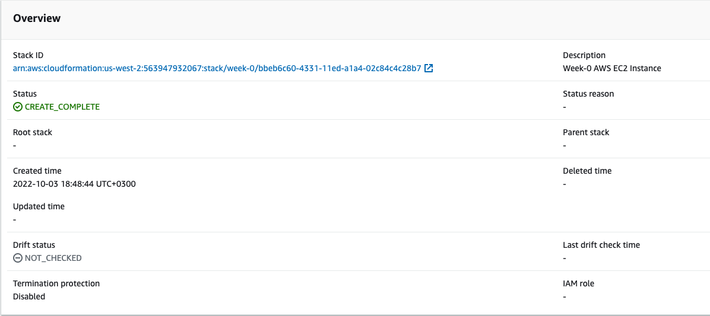
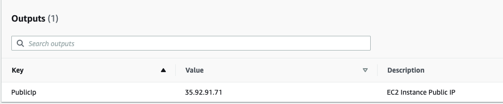
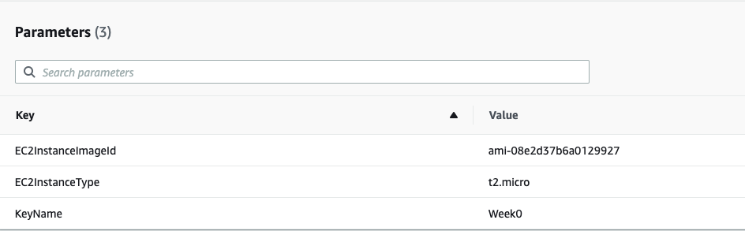

# Week 0
## Useful Links
https://docs.aws.amazon.com/AWSCloudFormation/latest/UserGuide/aws-properties-ec2-instance.html
## Homework
Create Cloudformation script that will create Single EC2 Instance.
### Requirements
Use `Parameters` section for customization of inputs.
Use `Outputs` section to show public IP of the instance
### Solution
[Cloudformation Script](./cloudformation/week-0.yaml)
Create Stack
```shell
aws cloudformation create-stack --profile lohika --template-body file:///Users/avlasov/git/lohika/aws/cloudformation/week-0.yaml --stack-name week-0 --region us-west-2 --parameters ParameterKey=KeyName,ParameterValue=Week0
```

Delete Stack
``` shell
aws cloudformation delete-stack --stack-name week-0 --profile lohika 
```
#### Screenshots




# Week 1
## Useful Links
https://docs.aws.amazon.com/autoscaling/ec2/userguide/creating-auto-scaling-groups-with-cloudformation.html
https://docs.aws.amazon.com/AWSCloudFormation/latest/UserGuide/quickref-autoscaling.html
https://docs.aws.amazon.com/AWSCloudFormation/latest/UserGuide/deploying.applications.html
https://docs.aws.amazon.com/AWSCloudFormation/latest/UserGuide
## Homework
Develop and deploy via AWS CLI CloudFormation script which will create next infrastructure
* Auto-scaling group (ASG) with two EC2 instances within it (we need to ensure that min amount of instances in the ASG is 2)
* Allow SSH and HTTP access to EC2 instances 
* Add the ability for EC2 instances to install Java 8 during startup
### Requirements
Use `Parameters` section for customization of inputs.
